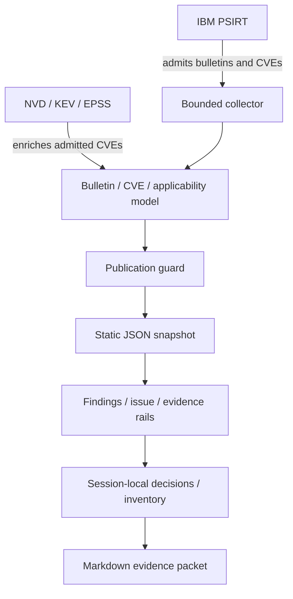

# Architecture

IBM i Vulnerability Curator is a static public curation and evidence-planning application. IBM PSIRT controls admission; other feeds enrich only admitted CVEs.

## Data units

- **Bulletin:** remediation-work unit and container for constituent CVEs.
- **Finding:** individually scored CVE with exploitation, severity, and action-lane context.
- **Applicability row:** product, release, and only remedies supported by the same IBM table row.
- **Unassociated remedy:** an identifier IBM published that cannot be paired defensibly with one applicability row.

## Trust boundaries

The scheduled workflow fetches public HTTPS sources. The browser receives sanitized static JSON and fixed terminal fixtures. Shop context, decision fields, imported inventory tokens, comparisons, and generated packets remain local. Pages has no backend, credentials, arbitrary terminal transport, or IBM i connection.

## Failure behavior

NVD fallback remains useful locally but cannot pass the Pages gate. A failed or materially narrow PSIRT refresh stops before deployment, retaining the prior Pages build.
